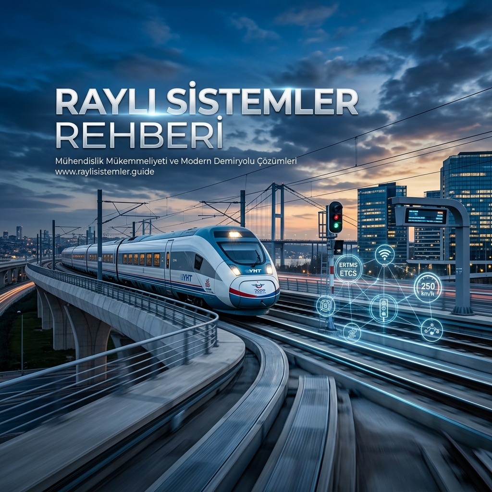

# 🚄 Raylı Sistemler Rehberi (Railway Systems Engineering Guide)

**Raylı Sistemler Rehberi**, mekanik, elektrik-elektronik, inşaat ve yazılım disiplinlerinin mükemmel bir uyum içinde çalıştığı **Raylı Sistemler Mühendisliği** alanında Türkçe hazırlanmış en kapsamlı, akademik derinliğe sahip açık kaynaklı yol haritası ve teknik referans deposudur.

Bu depo, yüksek hızlı trenlerden (YHT) kentsel metro ağlarına, otonom sinyalizasyon sistemlerinden (CBTC) hat altyapısına kadar uzanan bu stratejik alanda uzmanlaşmak isteyen mühendisler için sıfırdan ileri seviyeye bir müfredat sunar.

---

## 📑 İçindekiler

1. [🚀 Vizyon ve Strateji](#-vizyon-ve-strateji)
2. [🌍 Küresel Vizyon (Liderlik Rehberi)](VIZYON_2053.md)
3. [🎓 Akademik Müfredat (4 Yıllık Plan)](#-akademik-müfredat-4-yıllık-plan)
4. [🛠️ Teknik Modüller ve Uzmanlıklar](#-teknik-modüller-ve-uzmanlıklar)
5. [💻 Simülasyonlar ve Yazılımlar](#-simülasyonlar-ve-yazılımlar)
6. [🌐 İnteraktif Dashboard](#-interaktif-dashboard)
7. [📜 Standartlar ve Sertifikasyon](#-standartlar-ve-sertifikasyon)
8. [🤝 Katkıda Bulunma ve İletişim](#-katkıda-bulunma-ve-iletişim)

---

## 🚀 Vizyon ve Strateji

Raylı sistemler sadece ulaşım değil; enerji verimliliği, sürdürülebilirlik ve ileri teknolojinin kalbidir. Bu rehber, Türkiye'nin milli teknoloji hamlesi doğrultusunda gelişen demiryolu ekosistemine (Maglev, Hyperloop, Hidrojen Yakıtlı Trenler) adapte olabilen, uluslararası normlara (UIC, EN, TSI) hakim mühendisler yetiştirmeyi hedefler.

👉 Detaylı analiz ve yol haritası için: [**Küresel Vizyon ve 2053 Stratejisi**](VIZYON_2053.md)

---

## 🎓 Akademik Müfredat (4 Yıllık Plan)

Bu müfredat, bir mühendisin ihtiyaç duyacağı teorik ve pratik bilgileri dört ana faza ayırır:

### 🔹 [Yıl 1: Mühendislik Temelleri](mufradat/yil-1-temeller/README.md)
*   **Mekanik ve Fizik:** Statik, dinamik ve katı cisim temelleri.
*   **Yazılım Giriş:** Python ve C++ ile algoritmik düşünme.
*   **CAD:** AutoCAD ve SolidWorks ile teknik çizim.

### 🔹 [Yıl 2: Disiplinlerarası Mühendislik](mufradat/yil-2-muhendislik/README.md)
*   **Malzeme Bilimi:** Ray çelikleri ve yorulma analizleri.
*   **Elektrik-Elektronik:** Güç elektroniği ve motor sürücüleri.
*   **Termodinamik:** Fren sistemleri ve pnömatik.

### 🔹 [Yıl 3: Çekirdek Demiryolu Teknolojileri](mufradat/yil-3-cekirdek/README.md)
*   **Rolling Stock:** Boji mimarisi, süspansiyon ve araç gövdesi.
*   **Altyapı ve Üstyapı:** Balastlı/balastsız hatlar ve geometri.
*   **Cer (Traction) Sistemleri:** Katener ve üçüncü ray tasarımı.

### 🔹 [Yıl 4: İleri Sistemler ve Otonomi](mufradat/yil-4-ileri-teknoloji/README.md)
*   **Sinyalizasyon:** ERTMS/ETCS, CBTC ve otonom sürüş.
*   **RAMS ve Emniyet:** EN 50126/128/129 standartları.
*   **Gelecek Teknolojileri:** Maglev ve Hyperloop dinamikleri.

---

## 💻 Simülasyonlar ve Yazılımlar

Rehber içerisinde pratik uygulama için geliştirilen araçlar:
*   [**Train Dynamics Simulator**](simulasyonlar/train_motion.py): Tren ivmelenme ve frenleme eğrileri analizi.
*   [**Signal Logic Checker**](simulasyonlar/signal_logic.py): Hat devreleri ve anklaşman mantığı simülasyonu.

---

## 🌐 İnteraktif Dashboard

Projeyi daha görsel bir şekilde deneyimlemek ve müfredat akışını takip etmek için geliştirdiğimiz web arayüzüne göz atın:
👉 [**Rehber Dashboard**](dashboard/index.md) (Yerel olarak `dashboard/index.html` üzerinden erişilebilir).

---

## 📜 Standartlar ve Sertifikasyon

Dünya genelinde geçerli olan temel standartlar:
*   **CENELEC EN 50126/128/129:** Yazılım ve donanım emniyet bütünlük seviyeleri (SIL).
*   **UIC & TSI:** Karşılıklı işletilebilirlik ve teknik şartnameler.

---

## 🤝 Katkıda Bulunma

Bu proje topluluk desteği ile büyür. Detaylı bilgi için [CONTRIBUTING.md](CONTRIBUTING.md) dosyasını inceleyebilirsiniz.

---

## ⚖️ Lisans

Bu proje [MIT Lisansı](LICENSE) ile korunmaktadır.